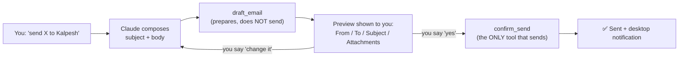
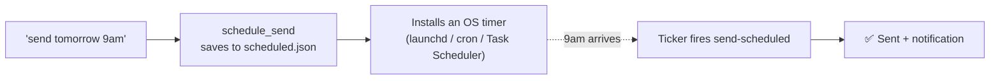
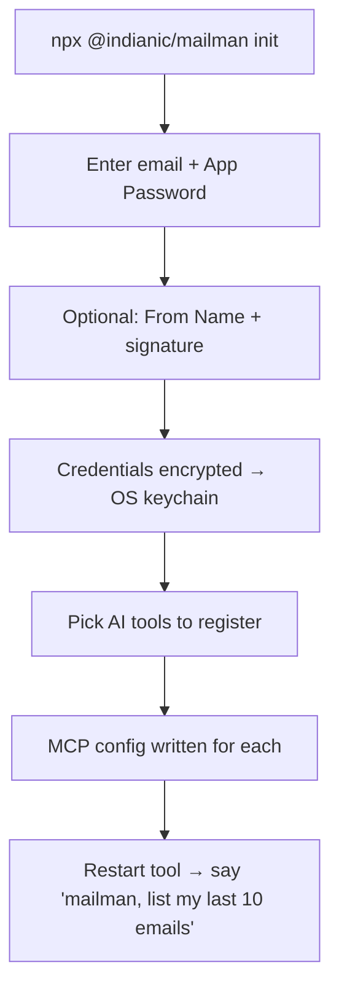
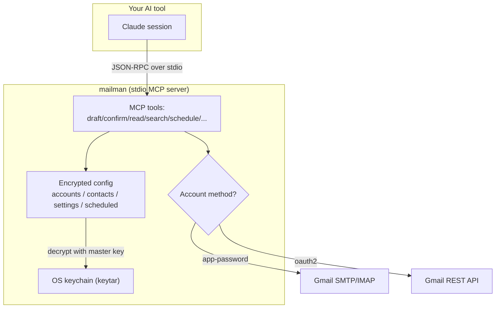

# mailman — Features, Flows & How It Works

*A complete tour of everything mailman does today — written so a
non-technical reader and an engineer can both follow it. Non-technical
readers can stop at the end of each **“In plain words”** note; the
**“Under the hood”** lines are for the technically curious.*

---

## 1. What is mailman? (the one-paragraph version)

**mailman lets you send and read email just by asking your AI assistant in
plain English** — “send those docs to Kalpesh,” “show my last 10 emails,”
“reply politely and decline.” It plugs into AI coding tools (Claude Code,
Cursor, Gemini CLI, Windsurf, Codex) and talks to your Gmail directly. You
set it up once, and it works from anywhere you use your AI tool.

> **Under the hood:** mailman is a Node.js **MCP server** (Model Context
> Protocol). Your AI tool launches it over a pipe (`npx -y @indianic/mailman`)
> and calls its “tools” from natural language. It reaches Gmail two ways:
> **SMTP/IMAP** (for App Password accounts) or the **Gmail REST API** (for
> OAuth2 accounts). Pure Node — same behavior on macOS, Linux, Windows.

---

## 2. The two ways you interact with mailman

mailman has **two front doors**. This split is intentional and is the single
most important idea for understanding it.

| | **The AI door (MCP tools)** | **The terminal door (CLI)** |
|---|---|---|
| Who uses it | Your AI assistant, on your behalf | You, typing commands |
| For what | Everyday email: send, read, search, schedule | Setup, accounts, diagnostics, credentials |
| Example | *“mailman, email this to Kalpesh”* | `mailman init`, `mailman doctor` |
| Why separate | An AI should never touch credentials or system-level settings | Anything sensitive or destructive stays out of the AI’s reach |

> **In plain words:** Talking to your AI = sending/reading mail. Typing
> `mailman ...` yourself = installing, adding accounts, and fixing problems.

---

## 3. Core safety idea: nothing sends without your OK

Every send follows a **draft → preview → confirm** flow. mailman *never*
sends an email the moment you ask. It first prepares a draft and shows you
exactly what will go out; only after you say “yes” does it actually send.

> **In plain words:** You always see a preview and confirm before anything
> leaves your machine.
>
> **Under the hood:** `draft_email` creates a short-lived draft (default
> 10-minute TTL) and returns a preview. `confirm_send` is the *only* tool
> that dispatches mail, and it’s **idempotent** — retrying after an
> ambiguous result returns the original send instead of double-sending.

---

## 4. Feature list (grouped)

### 4.1 Setup & accounts
- **One-command setup wizard** — `mailman init` adds your first Gmail
  account, encrypts the credentials, sets it as default, and writes the MCP
  config into whichever AI tools you pick.
- **Multiple accounts** — add as many as you like; one is the default.
- **Two login methods** — simple **App Password** (default) or **OAuth2**
  (for Workspace admins who disabled app passwords, or Google Contacts).
- **Editor registration** — `mailman register` wires mailman into Claude
  Code, Cursor, Gemini CLI, Windsurf, or Codex (idempotent — safe to re-run).

> **Under the hood:** Accounts live in `accounts.json` (encrypted). App
> Password needs only your email + a 16-char Google app password; OAuth2 uses
> *your own* Google Cloud client and a loopback browser consent flow (with an
> `ssh -L` fallback for headless boxes).

### 4.2 Sending email
- **Natural-language send** with the draft/preview/confirm safety flow above.
- **To / Cc / Bcc**, plain-text or HTML body.
- **“From Name”** — recipients see *“Kalpesh Gamit <you@gmail.com>”* instead
  of a bare address.
- **Auto signature** — a signature you set once is appended to every send.
- **Branded Message-ID** — each sent email carries an identifiable
  `mcp-mailman` Message-ID and `X-Mailer` header.

### 4.3 Attachments
- Attach **files, whole folders, or wildcard patterns** (`*.pdf`).
- **Preview what would attach** before drafting (`preview_attachments`).
- **Size guard** — refuses to exceed Gmail’s ~25 MB limit with a clear error.

### 4.4 Scheduled sends (“send this tomorrow at 9am”)
- Schedule an email for the future; it goes out **even if your AI tool is
  closed**.
- List and cancel pending scheduled sends.

> **Under the hood:** The first schedule installs a recurring OS job
> (launchd on macOS, cron on Linux, Task Scheduler on Windows). It calls
> `mailman send-scheduled --due`, which dispatches anything due through the
> same path as `confirm_send`, with retry-until-cap on failure.

### 4.5 Reading & searching your inbox
- **List recent emails** — “show my last 10” (inbox or sent).
- **Read a full email** — body + metadata (attachment info, not the bytes).
- **Search** — by keyword, sender, subject, date, `has:attachment`, etc.
- **Mailbox overview** — sent + inbox + unread counts + attachments in one call.

> **Under the hood:** Reads go through the **Gmail API** for OAuth2 accounts
> and **IMAP** for App Password accounts, normalized to one output shape.
> OAuth2 gets Gmail’s full search syntax; App Password gets a simpler subset
> (an honest capability difference, not a bug). Bodies cap at ~20k chars with
> a `truncated` flag.

### 4.6 Contacts & recipient suggestions
- **Auto-remembered recipients** — everyone you send to is remembered.
- **Fuzzy suggestions** — “email John” → mailman suggests matching addresses.
- **Manual address book** — add/remove contacts yourself.
- **Google Contacts merge** — for OAuth2 accounts.

### 4.7 Desktop notifications
- A native **“email sent”** desktop notification after each successful send —
  interactive *and* scheduled.
- **On by default**; disable with
  `mailman settings set desktopNotifications false`.

> **Under the hood:** Uses each OS’s built-in mechanism, no extra
> dependencies — macOS Notification Center (`osascript`), Linux `notify-send`,
> Windows toast. Best-effort: never blocks or fails a send. *(macOS note: it
> appears under “Script Editor’s” identity — ensure that’s allowed in System
> Settings → Notifications.)*

### 4.8 Security & privacy
- **Machine-bound encryption** — your credentials are encrypted with a key
  stored in your OS’s native keychain, never in a plain file.
- **Copy-proof** — copying the config to another machine yields useless
  ciphertext; mailman refuses to decrypt rather than degrade.
- **Audit log** — every action is logged locally (tool name + metadata, never
  bodies or credentials).

> **Under the hood:** AES-256-GCM over `accounts.json`/`scheduled.json`; the
> master key lives in Keychain / Credential Manager / Secret Service via
> `keytar`. `auth rotate-key` re-encrypts everything under a fresh key.

### 4.9 Keeping current
- **Update notice** — any command shows a one-line “update available” banner
  when a newer version is published (cached daily, never slows you down).
- **Self-update** — `mailman update` upgrades the global install in place.

### 4.10 Diagnostics & maintenance
- `mailman doctor` — pre-flight checks (Node version, keychain reachable,
  Gmail SMTP/IMAP reachable, scheduler installed).
- `mailman status` — what’s configured right now, as a clean tree.
- `mailman reset` — wipe everything for a clean re-setup (requires `--yes`).

---

## 5. Two end-to-end walkthroughs

### First-time setup

### A day-to-day send

1. You: *“mailman, send the checklist to Kalpesh.”*
2. Claude resolves the file, composes a subject/body, calls `draft_email`.
3. mailman shows the preview (From, To, Subject, attachment, signature note).
4. You: *“send it.”*
5. `confirm_send` dispatches → ✅ + a desktop notification.

---

## 6. Behind the scenes (architecture, for engineers)

- **Transport:** stdio JSON-RPC; the AI tool spawns mailman per session.
- **Output:** every tool returns plain JSON (host-agnostic) — rendering is
  the AI’s job, so any MCP host displays it its own way.
- **Errors:** structured `{ code, message }` so the AI can branch (retry on
  `RATE_LIMITED`, re-ask on `AMBIGUOUS_ACCOUNT`, etc.).
- **Storage (global, per-OS-user — never inside a project):**

  | OS | Path |
  |---|---|
  | macOS | `~/Library/Application Support/mcp-mailman/` |
  | Linux | `~/.config/mcp-mailman/` |
  | Windows | `%APPDATA%\mcp-mailman\` |

---

## 7. Full reference

### MCP tools (what Claude calls)

| Tool | Purpose |
|---|---|
| `draft_email` | Prepare a send + preview (does not send); supports `template`, `theme`, and `fwd`/`reply` quoting |
| `list_templates` | Browse message templates (subject prefix + composition hint); `category`/`search`/`all` |
| `confirm_send` | Send the drafted email (only tool that sends) |
| `cancel_draft` | Discard a pending draft |
| `schedule_send` | Send a draft at a future time |
| `list_scheduled` / `cancel_scheduled` | List / cancel scheduled sends |
| `list_recent_emails` | Recent inbox or sent mail |
| `read_email` | Full content of one email |
| `search_emails` | Search a folder / all mail |
| `get_mailbox_overview` | Sent + inbox + counts in one call |
| `suggest_recipients` | Ranked address suggestions for a name |
| `list_contacts` / `add_contact` / `remove_contact` | Address book |
| `preview_attachments` | What files a path/glob/dir would attach |
| `list_accounts` / `configure_account` / `update_account_profile` / `remove_account` | Account management |
| `get_settings` / `update_settings` | Global settings |
| `get_status` | Configured state (accounts, security, activity) |

### CLI commands (what you type)

| Command | Purpose |
|---|---|
| `mailman init` | First-run setup wizard |
| `mailman account add/list/remove/set-default/profile` | Manage accounts, From Name & signature |
| `mailman auth login` / `auth rotate-key` | OAuth2 consent / rotate encryption key |
| `mailman contacts list/add/remove` | Address book |
| `mailman settings get/set` | View / change settings (incl. `desktopNotifications`) |
| `mailman register` | Register with AI editors |
| `mailman doctor` | Environment pre-flight checks |
| `mailman scheduled list` | Pending/sent/failed scheduled sends |
| `mailman status` | Configured state as a tree |
| `mailman update` (`upgrade`) | Self-update to the latest version |
| `mailman reset` | Wipe config for a clean re-setup (`--yes`) |
| `mailman help` / `examples` / `--version` | Help, examples, version |

---

## 8. Status — what’s built and verified

**Complete & closed (2026-07-02).**

- **All 10 build phases (0–9) implemented**, plus post-launch additions
  (`get_mailbox_overview`, From Name/signature, Message-ID branding, desktop
  notifications, passive update notice).
- **Verified against a live Gmail account** (App Password): send, list, read,
  and search all confirmed end-to-end on **macOS** and **Linux** (Docker).
- **Descoped by decision** (not open gaps): OAuth2 real-delivery verification
  (App Password is the supported path; OAuth2 stays smoke-tested), Windows
  hardware verification (accepted as-is), and a public `npm` release
  (distribution is `@indianic/mailman` on the IndiaNIC private registry).

*See also: [README.md](../README.md) · [PLAN.md](PLAN.md) (architecture) ·
[SKILLS.md](SKILLS.md) (tool specs) · [CLI.md](CLI.md) (commands) ·
[CROSS-OS.md](CROSS-OS.md) (per-OS support).*
